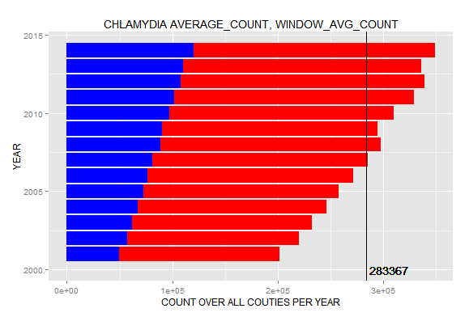
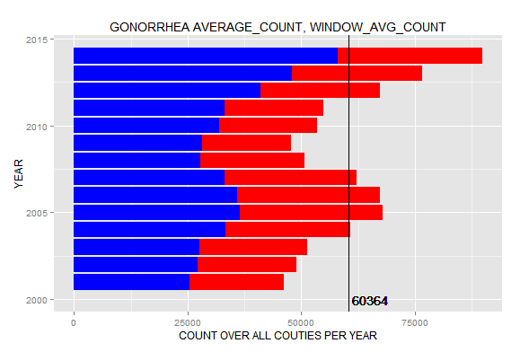
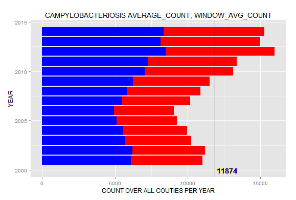
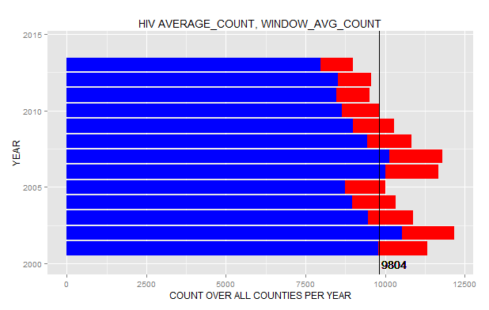
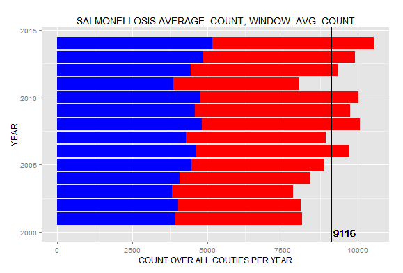
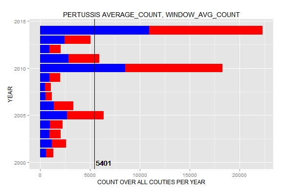
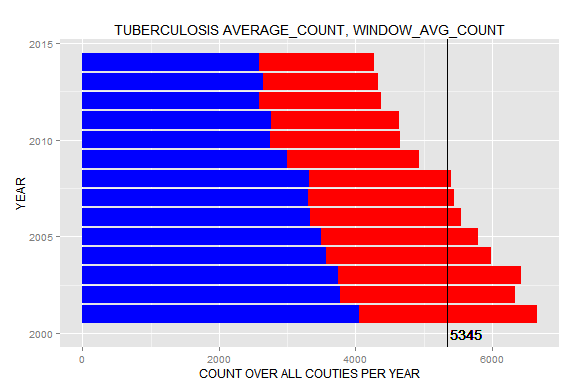
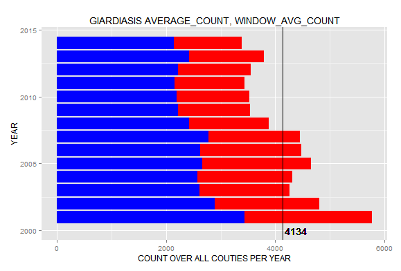
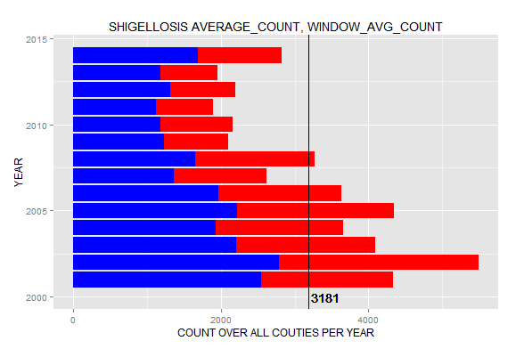

For this project, we found two sets of data which contained infectious disease cases and immunization counts in California. We blended the data on the respective "Disease" columns in the two data sets.

Here is a plot of what we found in Tableau:
  

And here is the corresponding R code and plot:
```
require("jsonlite")
require("RCurl")
require(ggplot2)
require(dplyr)

df <- data.frame(fromJSON(getURL(URLencode(gsub("\n", " ", 'skipper.cs.utexas.edu:5001/rest/native/?query="""select Immunization || \\\' \\\' || \\\'Immunization_Count\\\' as measure_names, sum(Immunization_Count) as measure_values from Immunizations 
where Immunization = \\\'Diphtheria\\\' || \\\'Measles\\\' || \\\'Mumps\\\' || \\\'Pertussis\\\' || \\\'Rubella\\\' || \\\'Tetanus\\\' 
group by Immunization 
union all 
select Disease || \\\' \\\' || \\\'Count\\\' as measure_names, sum(Count) as measure_values from California_Diseases 
group by Disease 
order by 1;"""')), httpheader=c(DB='jdbc:oracle:thin:@sayonara.microlab.cs.utexas.edu:1521:orcl', USER='C##cs329e_jnw653', PASS='orcl_jnw653', MODE='native_mode', MODEL='model', returnDimensions = 'False', returnFor = 'JSON'), verbose = TRUE)));

ggplot() + 
  coord_cartesian() + 
  scale_x_discrete() +
  scale_y_continuous() +
  #facet_wrap(~CLARITY, ncol=1) +
  labs(title='Disease vs. Immunization Count') +
  labs(x=paste("Disease"), y=paste("Immunization Count")) +
  layer(data=df, 
        mapping=aes(x=MEASURE_NAMES, y=MEASURE_VALUES), 
        stat="identity", 
        stat_params=list(), 
        geom="bar",
        geom_params=list(colour="black"), 
        position=position_identity()
  ) + coord_flip() +
  layer(data=df, 
        mapping=aes(x=MEASURE_NAMES, y=MEASURE_VALUES, label=round(MEASURE_VALUES)), 
        stat="identity", 
        stat_params=list(), 
        geom="text",
        geom_params=list(colour="blue", vjust=-0.5, hjust=-0.1), 
        position=position_identity()
  ) +
  layer(data=df, 
        mapping=aes(x=MEASURE_NAMES, y=MEASURE_VALUES, label="*"), 
        stat="identity", 
        stat_params=list(), 
        geom="text",
        geom_params=list(colour="blue", vjust=1.5, hjust=-0.1), 
        position=position_identity()
  )
```
  

##Project 4 Plots:  

###Scatter Plot:  
####Tableau:


The above scatterplot shows the average count of infectious disease among counties in the state of California by sex. Additionally, we have include the total, male and female, count for emphasis. Interesting aspects of the plot include an apparent sinusoidal behavior amongst males, females, and male/female total. Curiously, the infectious diseases appear to occur in waves for both men and women. In general, the implemented trend lines suggest that despite the "up and down" behavior of the data, infectious disease appear to be increasing in number of cases as time increses, with women contracting more overall number of diseases than men. Data such as this could be used to analyze which sex would be in more need of vaccinations, healthcare reform programs, or overall affect value. Ultimately, the total number of cases continues to increase for both men and women combined. 
  
###R & ggplot:  
####Code:  
```
require("jsonlite")
require("RCurl")
require("ggplot2")
require("dplyr")
require(extrafont)

df <- data.frame(fromJSON(getURL(URLencode('skipper.cs.utexas.edu:5001/rest/native/?query="select * from Infectious_Diseases where COUNTY NOT IN (\'California\')"'),httpheader=c(DB='jdbc:oracle:thin:@sayonara.microlab.cs.utexas.edu:1521:orcl', USER='C##cs329e_cmm5627', PASS='orcl_cmm5627', MODE='native_mode', MODEL='model', returnDimensions = 'False', returnFor = 'JSON'), verbose = TRUE), ))


df %>% select(SEX, mean(COUNT), YEAR) %>% ggplot(aes(y = mean(COUNT), x = YEAR, color = SEX)) + ggtitle("Average Count of Infectious Diseases by Sex") + geom_point() + scale_y_continuous() + scale_x_continuous() + coord_cartesian() 

Male_df <- df %>% select(SEX, mean(COUNT), YEAR) %>% filter(SEX == "Male")
Female_df <- df %>% select(SEX, mean(COUNT), YEAR) %>% filter(SEX == "Female")

Male_df %>% select(SEX, mean(COUNT), YEAR) %>% ggplot(aes(y = mean(COUNT), x = YEAR, color = "Male")) + ggtitle("Average Count of Infectious Diseases by Sex") + geom_point() + scale_y_continuous() + scale_x_continuous() + coord_cartesian() 

Female_df %>% select(SEX, mean(COUNT), YEAR) %>% ggplot(aes(y = mean(COUNT), x = YEAR, color = Female)) + ggtitle("Average Count of Infectious Diseases by Sex") + geom_point() + scale_y_continuous() + scale_x_continuous() + coord_cartesian()  
```
```{r}
source("../03 R SQL Visualizations/Scatter1.R", echo = TRUE)
```
```{r}
source("../03 R SQL Visualizations/Scatter2.R", echo = TRUE)
```
```{r}
source("../03 R SQL Visualizations/Scatter3.R", echo = TRUE)
```


###Crosstab with a KPI and Parameters:  
####Talbeau:  


These crosstabs display how many people per county were infected with some disease, broken down by males and females, as well as the two combined. The county called "California" is the total of all of the counties. Some counties to note are Alameda, where a significantly larger amount of females had diseases versus males, and the same is true for Fresno. Modoc had very few total diseases, as well as Alpine.

###R and ggplot:  
####Code: 
```
require("jsonlite")
require("RCurl")
require("ggplot2")
require("dplyr")

KPI_Very_Low_value = 0
KPI_Low_value = 10
KPI_Medium_value = 100

df <- diseases %>% group_by(SEX, COUNTY) %>% summarize(avg_count = mean(COUNT)) %>% mutate(kpi = avg_count) %>% mutate(kpi = ifelse(kpi <= KPI_Very_Low_value, 'Very Low', ifelse(kpi <= KPI_Low_value, 'Low', ifelse(kpi <= KPI_Medium_value, 'Medium', 'High'))))

ggplot() + 
  coord_cartesian() + 
  scale_x_discrete() +
  scale_y_discrete() +
  labs(title='Number of Diseases per Sex per County') +
  labs(x=paste("SEX"), y=paste("County")) +
  layer(data=df, 
        mapping=aes(x=SEX, y=COUNTY, label=round(avg_count, 2)),
        stat="identity", 
        stat_params=list(), 
        geom="text",
        geom_params=list(colour="black", size = 3), 
        position=position_identity()
  ) +
  layer(data=df, 
        mapping=aes(x=SEX, y=COUNTY, label=round(avg_count, 2)),
        stat="identity", 
        stat_params=list(), 
        geom="text",
        geom_params=list(colour="black", vjust=4, hjust=-1, size = 3), 
        position=position_identity()
  ) +
  layer(data=df, 
        mapping=aes(x=SEX, y=COUNTY, fill=kpi), 
        stat="identity", 
        stat_params=list(), 
        geom="tile",
        geom_params=list(alpha=0.50), 
        position=position_identity()
  ) + theme(axis.text.y = element_text(face = "plain", size = 8))
```
```{r}
source("../01 Data/InfectiousDiseases.R", echo = FALSE)
```
```{r}
source("../03 R SQL Visualizations/Crosstab_jnw.R", echo = TRUE)
```
  
###Bar Chart with Reference Lines: 
####Tableau: 


These bar charts show each disease in a panel. Each panel shows the count each year from 2001 to 2014. Specifically, each bar within the panel sums up the count for that particular disease spanning all counties of California for that specified year. The reference line is the average count for each disease over the course of 14 years (2001-2014). It is particularly interesting to observe which years had above the average count for each disease. These bar charts are interesting because you can see how the total count changes from year to year within each disease, and you can also see if males or females have the higher count. For example, the data suggests that the Chlamydia count has a positive correlation with time and also that more females tend to have Chlamydia compared to men. I decided to include all diseases so that it is easy to see which disease is affecting Calfornia's population the most. As you can see, Chlamydia, Gonorrhea, Campylobacteriosis, HIV, Salmonellosis, Early Syphilis, Coccidioidomycosis, Pertussis, Tuberculosis, Giardiasis, Shingellosis have the above 3000 average counts. Certain diseases can easily be filtered to study trends in diseases with lower counts. Here is an example:


###R and ggplot:  







 

 
 
####Code: 
```
df <- data.frame(fromJSON(getURL(URLencode(gsub("\n", " ", 'skipper.cs.utexas.edu:5001/rest/native/?query=
"select YEAR, DISEASE, sum_COUNT, sum(sum_COUNT) 
OVER (PARTITION BY DISEASE) as window_avg_COUNT
from 
(select YEAR, DISEASE, sum(COUNT) as sum_COUNT
from Infectious_Diseases
where DISEASE = (\'Chlamydia\') and (SEX=(\'Male\') OR SEX=(\'Female\') )
group by YEAR, DISEASE)
order by DISEASE;"
')), httpheader=c(DB='jdbc:oracle:thin:@sayonara.microlab.cs.utexas.edu:1521:orcl', USER='C##cs329e_hys82', PASS='orcl_hys82', MODE='native_mode', MODEL='model', returnDimensions = 'False', returnFor = 'JSON', p1=KPI_Low_Max_value, p2=KPI_Medium_Max_value), verbose = TRUE))); 

dfMALE <- data.frame(fromJSON(getURL(URLencode(gsub("\n", " ", 'skipper.cs.utexas.edu:5001/rest/native/?query=
"select YEAR, DISEASE, sum_COUNT, sum(sum_COUNT) 
OVER (PARTITION BY DISEASE) as window_avg_COUNT
from 
(select YEAR, DISEASE, sum(COUNT) as sum_COUNT
from Infectious_Diseases
where DISEASE = (\'Chlamydia\') and SEX=(\'Male\')
group by YEAR, DISEASE)
order by DISEASE;"
')), httpheader=c(DB='jdbc:oracle:thin:@sayonara.microlab.cs.utexas.edu:1521:orcl', USER='C##cs329e_hys82', PASS='orcl_hys82', MODE='native_mode', MODEL='model', returnDimensions = 'False', returnFor = 'JSON', p1=KPI_Low_Max_value, p2=KPI_Medium_Max_value), verbose = TRUE)));

ggplot() + 
  coord_cartesian() + 
  scale_x_continuous() +
  scale_y_continuous() +
  labs(title='CHLAMYDIA AVERAGE_COUNT, WINDOW_AVG_COUNT') +
  labs(x=paste("YEAR"), y=paste("COUNT OVER ALL COUTIES PER YEAR")) +
  layer(data=df, 
        mapping=aes(x=YEAR, y=SUM_COUNT), 
        stat="identity", 
        stat_params=list(), 
        geom="bar",
        geom_params=list(fill="RED"), 
        position=position_identity()
  ) + coord_flip() +
  layer(data=dfMALE, 
        mapping=aes(x=YEAR, y=SUM_COUNT), 
        stat="identity", 
        stat_params=list(), 
        geom="bar",
        geom_params=list(fill="BLUE"), 
        position=position_identity()
  ) + coord_flip() +
  layer(data=df, 
        mapping=aes(yintercept = WINDOW_AVG_COUNT/14), 
        geom="hline",
        geom_params=list(colour="BLACK")
  ) +
  layer(data=df, 
        mapping=aes(x=2000, y=round(WINDOW_AVG_COUNT/14), label=round(WINDOW_AVG_COUNT/14)), 
        stat="identity", 
        stat_params=list(), 
        geom="text",
        geom_params=list(colour="black", hjust=-.1), 
        position=position_identity()
  )

```
```
df <- data.frame(fromJSON(getURL(URLencode(gsub("\n", " ", 'skipper.cs.utexas.edu:5001/rest/native/?query=
"select YEAR, DISEASE, sum_COUNT, sum(sum_COUNT) 
                                                OVER (PARTITION BY DISEASE) as window_avg_COUNT
                                                from 
                                                (select YEAR, DISEASE, sum(COUNT) as sum_COUNT
                                                from Infectious_Diseases
                                                where DISEASE = (\'Gonorrhea\') and (SEX=(\'Male\') OR SEX=(\'Female\') )
                                                group by YEAR, DISEASE)
                                                order by DISEASE;"
                                                ')), httpheader=c(DB='jdbc:oracle:thin:@sayonara.microlab.cs.utexas.edu:1521:orcl', USER='C##cs329e_hys82', PASS='orcl_hys82', MODE='native_mode', MODEL='model', returnDimensions = 'False', returnFor = 'JSON', p1=KPI_Low_Max_value, p2=KPI_Medium_Max_value), verbose = TRUE))); 

dfMALE <- data.frame(fromJSON(getURL(URLencode(gsub("\n", " ", 'skipper.cs.utexas.edu:5001/rest/native/?query=
                                                    "select YEAR, DISEASE, sum_COUNT, sum(sum_COUNT) 
                                                    OVER (PARTITION BY DISEASE) as window_avg_COUNT
                                                    from 
                                                    (select YEAR, DISEASE, sum(COUNT) as sum_COUNT
                                                    from Infectious_Diseases
                                                    where DISEASE = (\'Gonorrhea\') and SEX=(\'Male\')
                                                    group by YEAR, DISEASE)
                                                    order by DISEASE;"
                                                    ')), httpheader=c(DB='jdbc:oracle:thin:@sayonara.microlab.cs.utexas.edu:1521:orcl', USER='C##cs329e_hys82', PASS='orcl_hys82', MODE='native_mode', MODEL='model', returnDimensions = 'False', returnFor = 'JSON', p1=KPI_Low_Max_value, p2=KPI_Medium_Max_value), verbose = TRUE)));

ggplot() + 
  coord_cartesian() + 
  scale_x_continuous() +
  scale_y_continuous() +
  labs(title='GONORRHEA AVERAGE_COUNT, WINDOW_AVG_COUNT') +
  labs(x=paste("YEAR"), y=paste("COUNT OVER ALL COUTIES PER YEAR")) +
  layer(data=df, 
        mapping=aes(x=YEAR, y=SUM_COUNT), 
        stat="identity", 
        stat_params=list(), 
        geom="bar",
        geom_params=list(fill="RED"), 
        position=position_identity()
  ) + coord_flip() +
  layer(data=dfMALE, 
        mapping=aes(x=YEAR, y=SUM_COUNT), 
        stat="identity", 
        stat_params=list(), 
        geom="bar",
        geom_params=list(fill="BLUE"), 
        position=position_identity()
  ) + coord_flip() +
  layer(data=df, 
        mapping=aes(yintercept = WINDOW_AVG_COUNT/14), 
        geom="hline",
        geom_params=list(colour="BLACK")
  ) +
  layer(data=df, 
        mapping=aes(x=2000, y=round(WINDOW_AVG_COUNT/14), label=round(WINDOW_AVG_COUNT/14)), 
        stat="identity", 
        stat_params=list(), 
        geom="text",
        geom_params=list(colour="black", hjust=-.1), 
        position=position_identity()
  )

```
```
df <- data.frame(fromJSON(getURL(URLencode(gsub("\n", " ", 'skipper.cs.utexas.edu:5001/rest/native/?query=
"select YEAR, DISEASE, sum_COUNT, sum(sum_COUNT) 
                                                OVER (PARTITION BY DISEASE) as window_avg_COUNT
                                                from 
                                                (select YEAR, DISEASE, sum(COUNT) as sum_COUNT
                                                from Infectious_Diseases
                                                where DISEASE = (\'Campylobacteriosis\') and (SEX=(\'Male\') OR SEX=(\'Female\') )
                                                group by YEAR, DISEASE)
                                                order by DISEASE;"
                                                ')), httpheader=c(DB='jdbc:oracle:thin:@sayonara.microlab.cs.utexas.edu:1521:orcl', USER='C##cs329e_hys82', PASS='orcl_hys82', MODE='native_mode', MODEL='model', returnDimensions = 'False', returnFor = 'JSON', p1=KPI_Low_Max_value, p2=KPI_Medium_Max_value), verbose = TRUE))); 

dfMALE <- data.frame(fromJSON(getURL(URLencode(gsub("\n", " ", 'skipper.cs.utexas.edu:5001/rest/native/?query=
                                                    "select YEAR, DISEASE, sum_COUNT, sum(sum_COUNT) 
                                                    OVER (PARTITION BY DISEASE) as window_avg_COUNT
                                                    from 
                                                    (select YEAR, DISEASE, sum(COUNT) as sum_COUNT
                                                    from Infectious_Diseases
                                                    where DISEASE = (\'Campylobacteriosis\') and SEX=(\'Male\')
                                                    group by YEAR, DISEASE)
                                                    order by DISEASE;"
                                                    ')), httpheader=c(DB='jdbc:oracle:thin:@sayonara.microlab.cs.utexas.edu:1521:orcl', USER='C##cs329e_hys82', PASS='orcl_hys82', MODE='native_mode', MODEL='model', returnDimensions = 'False', returnFor = 'JSON', p1=KPI_Low_Max_value, p2=KPI_Medium_Max_value), verbose = TRUE)));

ggplot() + 
  coord_cartesian() + 
  scale_x_continuous() +
  scale_y_continuous() +
  labs(title='CAMPYLOBACTERIOSIS AVERAGE_COUNT, WINDOW_AVG_COUNT') +
  labs(x=paste("YEAR"), y=paste("COUNT OVER ALL COUTIES PER YEAR")) +
  layer(data=df, 
        mapping=aes(x=YEAR, y=SUM_COUNT), 
        stat="identity", 
        stat_params=list(), 
        geom="bar",
        geom_params=list(fill="RED"), 
        position=position_identity()
  ) + coord_flip() +
  layer(data=dfMALE, 
        mapping=aes(x=YEAR, y=SUM_COUNT), 
        stat="identity", 
        stat_params=list(), 
        geom="bar",
        geom_params=list(fill="BLUE"), 
        position=position_identity()
  ) + coord_flip() +
  layer(data=df, 
        mapping=aes(yintercept = WINDOW_AVG_COUNT/14), 
        geom="hline",
        geom_params=list(colour="BLACK")
  ) +
  layer(data=df, 
        mapping=aes(x=2000, y=round(WINDOW_AVG_COUNT/14), label=round(WINDOW_AVG_COUNT/14)), 
        stat="identity", 
        stat_params=list(), 
        geom="text",
        geom_params=list(colour="black", hjust=-.1), 
        position=position_identity()
  )

```
